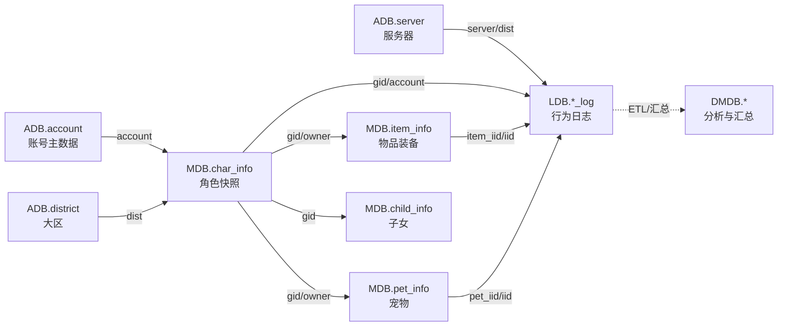
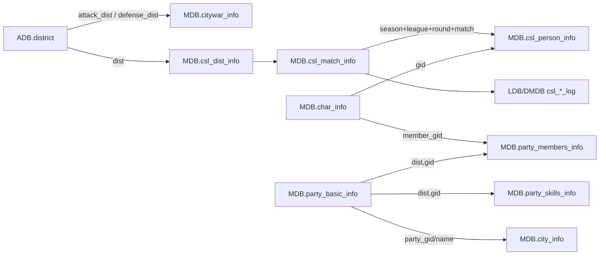
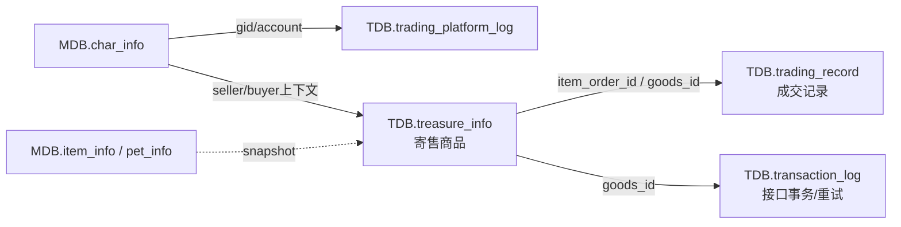
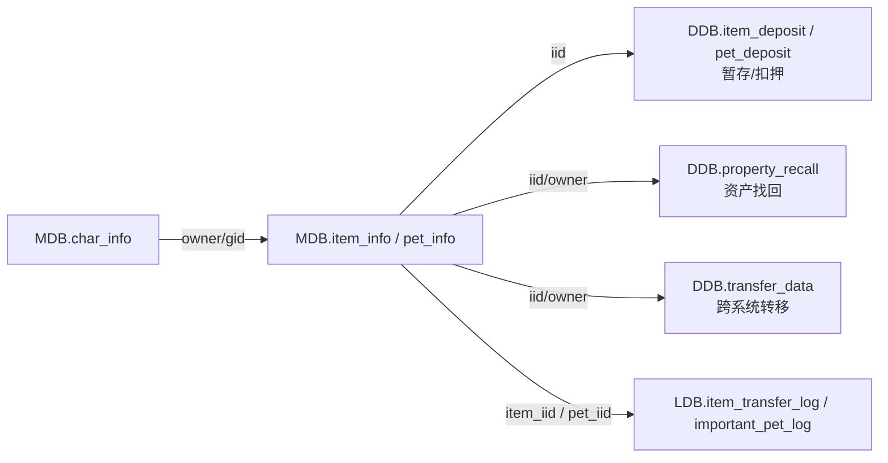

# SQL 核心表关系图

> 说明：原始 DDL 未定义 FOREIGN KEY。以下均为根据主键、字段名及业务语义还原的**逻辑关联**，不是数据库层强制约束。

## 1. 主业务链：账号 → 角色 → 资产 → 日志 → 分析

## 2. 帮派、城战与跨服赛事

## 3. 交易/寄售平台

## 4. 客服资产追踪链

完整的逐表关系请看 Excel 中的「逻辑关系」工作表。
